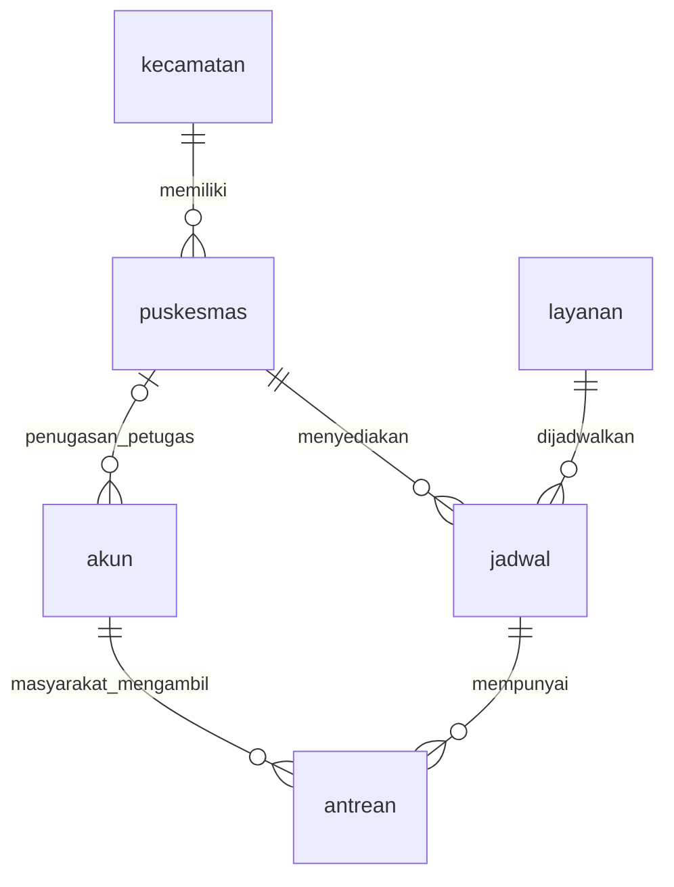

# Basis Data Proyek PuskesmasKu

Dokumen pembelajaran mata kuliah Basis Data, berdasarkan implementasi proyek pada 7 Oktober 2026. Contoh SQL di bawah menjelaskan operasi aplikasi; bukan instruksi untuk mengubah database produksi. Jangan menjalankan query perubahan tanpa memahami dampaknya dan membuat cadangan.

## 1. Gambaran sistem

PuskesmasKu menyediakan informasi fasilitas kesehatan, jadwal poli, rekomendasi, dan pengambilan antrean. Admin mengelola data master, petugas mengelola jadwal dan antrean puskesmasnya, sedangkan masyarakat mengambil serta melihat antreannya.

Arsitektur:

```text
Browser → Route Laravel → Controller/Model Eloquent → MySQL
Browser ← HTML atau JSON ← hasil query database
```

Database operasional menggunakan MySQL dari Laragon. Konfigurasi lokal yang terakhir diperiksa: database `rujuk_uts`, host `127.0.0.1`, port `3306`. Koneksi diatur melalui `.env` dan konfigurasi Laravel. Database disimpan oleh server MySQL, bukan sebagai file `.md` atau file PHP dalam proyek.

Untuk memeriksanya di tab Query HeidiSQL:

```sql
SHOW DATABASES;
USE rujuk_uts;
SHOW TABLES;
SHOW CREATE TABLE antrean;
```

Enam tabel yang dibahas adalah tabel bisnis. Tabel teknis seperti `migrations`, `sessions`, `cache`, dan `cache_locks` tidak dihitung sebagai entitas bisnis.

## 2. Kamus data enam tabel

Semua tabel bisnis juga memiliki `created_at` dan `updated_at`. ID utama menggunakan INT UNSIGNED. Daftar ini berfokus pada kolom bisnis, bukan penulisan DDL lengkap.

### 2.1 `kecamatan`

| Kolom | Tipe/aturan | Fungsi |
|---|---|---|
| kecamatan_id | INT, PK | Identitas kecamatan |
| nama_kecamatan | VARCHAR, UNIQUE | Nama wilayah |

### 2.2 `puskesmas`

| Kolom | Tipe/aturan | Fungsi |
|---|---|---|
| puskesmas_id | INT, PK | Identitas fasilitas |
| kecamatan_id | INT, FK, wajib | Kecamatan fasilitas |
| nama_puskesmas | VARCHAR, UNIQUE | Nama fasilitas |
| alamat | TEXT, wajib | Alamat fasilitas |
| latitude, longitude | DECIMAL(10,7), nullable | Koordinat peta |
| nomor_telepon | VARCHAR(20), nullable | Kontak |
| status | ENUM AKTIF/NONAKTIF | Ketersediaan fasilitas |

### 2.3 `akun`

| Kolom | Tipe/aturan | Fungsi |
|---|---|---|
| akun_id | INT, PK | Identitas akun |
| nik | VARCHAR(16), UNIQUE, nullable | Identitas masyarakat; bukan angka untuk dihitung |
| puskesmas_id | INT, FK, nullable | Penugasan petugas |
| nama_lengkap | VARCHAR, wajib | Nama pengguna |
| email | VARCHAR, UNIQUE, nullable | Identitas login |
| password_hash | VARCHAR, nullable | Hash kata sandi, bukan kata sandi asli |
| role | ENUM MASYARAKAT/PETUGAS/ADMIN | Jenis pengguna |
| status_akun | ENUM AKTIF/NONAKTIF | Status akses akun |
| status_data | ENUM AKTIF/NONAKTIF | Status data masyarakat/pengguna |
| nomor_telepon | VARCHAR(20), nullable | Kontak |
| alamat | TEXT, nullable | Alamat pengguna |

Data masyarakat dan akun login berada pada tabel yang sama. Sebelum aktivasi, masyarakat dapat memiliki NIK tetapi email/password kosong dan status akun NONAKTIF. Aktivasi memperbarui baris yang sama, bukan membuat masyarakat baru.

`puskesmas_id` boleh NULL untuk admin dan masyarakat. Untuk PETUGAS, aplikasi mewajibkan penugasan ke puskesmas aktif. Foreign key saja tidak memeriksa role.

### 2.4 `layanan`

| Kolom | Tipe/aturan | Fungsi |
|---|---|---|
| layanan_id | INT, PK | Identitas layanan |
| nama_layanan | VARCHAR, UNIQUE | Nama poli/layanan |
| deskripsi | TEXT, nullable | Penjelasan layanan |
| status | ENUM AKTIF/NONAKTIF | Ketersediaan layanan |

Membuat layanan di admin belum otomatis menempatkannya pada semua puskesmas. Hubungannya terbentuk ketika petugas membuat jadwal menggunakan layanan tersebut.

### 2.5 `jadwal`

| Kolom | Tipe/aturan | Fungsi |
|---|---|---|
| jadwal_id | INT, PK | Identitas jadwal berulang |
| puskesmas_id | INT, FK, wajib | Lokasi pelayanan |
| layanan_id | INT, FK, wajib | Poli/layanan |
| hari | ENUM SENIN sampai MINGGU | Hari praktik mingguan |
| jam_buka, jam_tutup | TIME, wajib | Rentang jam pelayanan |
| kapasitas | INT UNSIGNED | Batas antrean aktif per jadwal dan tanggal |
| nama_dokter | TEXT, nullable | Keterangan dokter pada jadwal |
| spesialisasi | TEXT, nullable | Keterangan spesialisasi |
| status | ENUM AKTIF/NONAKTIF | Status jadwal |

Kombinasi `(puskesmas_id, layanan_id, hari)` unik. Desain ini tidak menyediakan dua baris jadwal berbeda untuk poli dan hari yang sama di puskesmas yang sama.

Dokter tidak mempunyai tabel tersendiri. Nama dokter merupakan keterangan jadwal; perubahan pada satu jadwal tidak otomatis memperbarui jadwal lain. Ini penyederhanaan desain, bukan pemodelan master dokter yang lengkap.

### 2.6 `antrean`

| Kolom | Tipe/aturan | Fungsi |
|---|---|---|
| antrean_id | INT, PK | ID unik antrean |
| akun_id | INT, FK, wajib | Pemilik antrean |
| jadwal_id | INT, FK, wajib | Jadwal yang diambil |
| nomor_antrean | INT UNSIGNED | Nomor urut pada jadwal/tanggal |
| tanggal_daftar | DATE | Tanggal pelayanan yang dipilih |
| status_antrean | ENUM | WAITING/CALLED/SERVING/COMPLETED/CANCELLED |

Walaupun bernama `tanggal_daftar`, kolom ini dipakai sebagai tanggal pelayanan, bukan timestamp saat tombol ditekan. Waktu pembuatan baris berada di `created_at`.

Nomor `001` dapat muncul pada banyak jadwal atau tanggal. Identitas globalnya adalah `antrean_id`. Keunikan nomor berada pada kombinasi jadwal, tanggal, dan nomor antrean.

## 3. ERD dan relasi



| Parent → child | Kardinalitas | Foreign key pada child |
|---|---|---|
| kecamatan → puskesmas | 1:N | puskesmas.kecamatan_id |
| puskesmas → akun | 1:N; penugasan akun opsional dalam skema | akun.puskesmas_id |
| puskesmas → jadwal | 1:N | jadwal.puskesmas_id |
| layanan → jadwal | 1:N | jadwal.layanan_id |
| akun → antrean | 1:N | antrean.akun_id |
| jadwal → antrean | 1:N | antrean.jadwal_id |

Puskesmas dan layanan berhubungan M:N melalui `jadwal`: satu puskesmas memiliki beberapa layanan, dan satu layanan tersedia di beberapa puskesmas. `jadwal` sekaligus menyimpan atribut hubungan tersebut, seperti hari, jam, dokter, dan kapasitas.

## 4. Integritas data: database dan aplikasi

### Aturan pada database

- PRIMARY KEY membedakan setiap baris.
- FOREIGN KEY mencegah hubungan ke ID parent yang tidak ada.
- UNIQUE mencegah nama/identitas atau kombinasi kunci tertentu berulang.
- NOT NULL mewajibkan kolom penting diisi.
- ENUM membatasi pilihan status/role/hari.
- INDEX membantu pencarian dan penyaringan data; indeks biasa tidak menjamin keunikan.
- Relasi bisnis membatasi penghapusan parent yang masih dirujuk. Controller juga memeriksa penggunaan data sebelum menghapusnya.

MySQL UNIQUE pada kolom nullable masih memungkinkan beberapa nilai NULL. Karena itu banyak masyarakat yang belum aktivasi dapat memiliki email NULL tanpa saling berbenturan.

### Aturan pada aplikasi Laravel

- Pemilik antrean harus masyarakat, bukan admin/petugas.
- Petugas hanya mengelola jadwal dan antrean puskesmasnya sendiri.
- Tanggal antrean tidak boleh sebelum hari ini dan harus sesuai hari jadwal.
- Jadwal, layanan, puskesmas, serta data masyarakat harus memenuhi aturan status aktif.
- Antrean aktif masyarakat tidak boleh bertabrakan waktunya pada tanggal yang sama.
- Jumlah antrean aktif tidak boleh melebihi kapasitas.
- Perubahan status mengikuti urutan yang diizinkan.

SQL langsung melalui HeidiSQL dapat melewati aturan controller. Contohnya foreign key `antrean.akun_id` hanya memeriksa keberadaan akun, bukan memastikan role MASYARAKAT. Karena itu jangan menganggap semua aturan aplikasi otomatis dijamin oleh skema.

## 5. CRUD menurut role

| Role | Create | Read | Update | Delete |
|---|---|---|---|---|
| Admin | Master kecamatan, masyarakat, petugas, puskesmas, layanan | Data master | Data/status master dan penugasan petugas | Master yang memenuhi aturan penghapusan |
| Petugas | Jadwal dan antrean manual pada puskesmas sendiri | Jadwal dan antrean aktif puskesmas sendiri | Jadwal, dokter, kapasitas, status antrean | Jadwal yang tidak dirujuk; antrean selesai/dibatalkan sesuai endpoint |
| Masyarakat | Mengambil antrean | Informasi puskesmas, rekomendasi, antrean sendiri | Profil; aktivasi akun | Antrean sendiri berstatus WAITING |

Masyarakat tidak mempunyai tombol pembatalan lagi. Endpoint hapus masih menerima CANCELLED untuk kompatibilitas data lama, tetapi daftar masyarakat hanya menampilkan antrean aktif. Admin tidak otomatis mendapat akses route petugas: middleware membedakan role.

## 6. Contoh SQL dan maknanya

Query berikut adalah padanan konseptual operasi Eloquent. Query yang benar-benar dikirim Laravel dapat terbagi menjadi beberapa SELECT dengan parameter binding, khususnya ketika memakai eager loading.

### 6.1 JOIN: membaca antrean beserta masyarakat, poli, dan puskesmas

```sql
SELECT q.antrean_id, q.nomor_antrean, q.tanggal_daftar,
       q.status_antrean, a.nama_lengkap,
       p.nama_puskesmas, l.nama_layanan
FROM antrean AS q
JOIN akun AS a ON a.akun_id = q.akun_id
JOIN jadwal AS j ON j.jadwal_id = q.jadwal_id
JOIN puskesmas AS p ON p.puskesmas_id = j.puskesmas_id
JOIN layanan AS l ON l.layanan_id = j.layanan_id
WHERE q.status_antrean IN ('WAITING', 'CALLED', 'SERVING')
ORDER BY q.tanggal_daftar DESC, q.nomor_antrean DESC;
```

JOIN mengikuti foreign key. Tabel antrean tidak perlu mengulang nama masyarakat, nama poli, dan alamat puskesmas. Untuk petugas, aplikasi menambahkan batasan `j.puskesmas_id` sesuai akun yang login. Untuk masyarakat, batasannya `q.akun_id`.

### 6.2 Membaca jadwal suatu puskesmas

```sql
SET @puskesmas_id = 12; -- Contoh ID; sesuaikan dengan data
SELECT j.jadwal_id, l.nama_layanan, j.hari,
       j.jam_buka, j.jam_tutup, j.kapasitas, j.nama_dokter
FROM jadwal AS j
JOIN layanan AS l ON l.layanan_id = j.layanan_id
JOIN puskesmas AS p ON p.puskesmas_id = j.puskesmas_id
WHERE j.puskesmas_id = @puskesmas_id
  AND j.status = 'AKTIF'
  AND l.status = 'AKTIF'
  AND p.status = 'AKTIF';
```

### 6.3 GROUP BY: ringkasan antrean hari ini

```sql
SELECT p.puskesmas_id, p.nama_puskesmas,
       COUNT(q.antrean_id) AS total_antrean,
       SUM(CASE WHEN q.status_antrean IN
           ('WAITING', 'CALLED', 'SERVING') THEN 1 ELSE 0 END) AS aktif,
       SUM(CASE WHEN q.status_antrean = 'COMPLETED'
           THEN 1 ELSE 0 END) AS selesai
FROM puskesmas AS p
LEFT JOIN jadwal AS j ON j.puskesmas_id = p.puskesmas_id
    AND j.status = 'AKTIF'
    AND EXISTS (SELECT 1 FROM layanan AS l
                WHERE l.layanan_id = j.layanan_id AND l.status = 'AKTIF')
LEFT JOIN antrean AS q ON q.jadwal_id = j.jadwal_id
    AND q.tanggal_daftar = CURRENT_DATE()
WHERE p.status = 'AKTIF'
GROUP BY p.puskesmas_id, p.nama_puskesmas;
```

LEFT JOIN mempertahankan puskesmas yang belum memiliki antrean. `COUNT(q.antrean_id)` menghitung baris antrean, bukan baris kosong hasil join. API peta juga membatasi koordinat fasilitas pada rentang wilayah yang ditetapkan.

`CURRENT_DATE()` mengikuti zona waktu sesi MySQL. Aplikasi memakai Asia/Jakarta dan mengirim tanggal hasil perhitungan Laravel; ketika membandingkan hasil HeidiSQL, pastikan tanggal/zona waktunya sama.

### 6.4 Contoh perubahan data (ilustrasi, jangan asal dijalankan)

```sql
-- CREATE: data master baru
INSERT INTO layanan (nama_layanan, deskripsi, status, created_at, updated_at)
VALUES ('Layanan Contoh', 'Contoh pembelajaran', 'AKTIF', NOW(), NOW());

-- UPDATE: hanya antrean yang masih WAITING
UPDATE antrean
SET status_antrean = 'CALLED', updated_at = NOW()
WHERE antrean_id = 123 AND status_antrean = 'WAITING';

-- DELETE: ilustrasi pembatasan kepemilikan dan status
DELETE FROM antrean
WHERE antrean_id = 123 AND akun_id = 456
  AND status_antrean = 'WAITING';
```

ID tersebut hanya contoh. Dalam aplikasi, identitas pengguna diperoleh dari sesi login, bukan dipercaya dari input bebas. Query dibuat dengan Eloquent/Query Builder dan parameter binding untuk menghindari penggabungan input pengguna langsung ke string SQL.

## 7. Transaksi ketika mengambil antrean

Alur implementasi:

1. Validasi input dan status data terkait.
2. Mulai transaksi database (`DB::transaction`).
3. Kunci akun masyarakat dengan `lockForUpdate`.
4. Kunci baris jadwal yang dipilih dengan `lockForUpdate`.
5. Periksa antrean aktif yang sudah ada dan bentrok waktu.
6. Hitung kapasitas terpakai pada jadwal dan tanggal tersebut.
7. Hitung nomor berikutnya: `MAX(nomor_antrean) + 1`.
8. INSERT antrean berstatus WAITING.
9. COMMIT jika berhasil; exception menyebabkan ROLLBACK.

Padanan garis besar SQL:

```sql
START TRANSACTION;
SELECT akun_id FROM akun WHERE akun_id = ? FOR UPDATE;
SELECT jadwal_id, kapasitas FROM jadwal WHERE jadwal_id = ? FOR UPDATE;
-- Periksa duplikasi, bentrok, kapasitas, dan nomor berikutnya.
-- INSERT INTO antrean (...) VALUES (...);
COMMIT;
```

Tanda `?` adalah placeholder parameter aplikasi, bukan query yang langsung dapat ditempel di HeidiSQL. Semua jalur penambahan yang ingin mendapat jaminan serupa perlu mengikuti protokol penguncian yang sama.

Tujuan penguncian: bila dua orang berebut satu slot terakhir pada jadwal yang sama, pemeriksaan kedua menunggu transaksi pertama selesai lalu membaca kapasitas terbaru. Penguncian akun juga membantu mencegah dua pemesanan bertabrakan untuk orang yang sama.

Kaitan dengan ACID:

- Atomicity: pemeriksaan dan penyimpanan menjadi satu kesatuan transaksi.
- Consistency: constraint database dan validasi aplikasi menjaga aturan data.
- Isolation: transaksi/penguncian mengendalikan operasi bersamaan.
- Durability: transaksi yang berhasil disimpan oleh database, sesuai konfigurasi penyimpanan server.

## 8. Bentrok waktu, kapasitas, dan nomor

Dua jadwal bertabrakan jika berada pada tanggal yang sama dan:

```text
jam_buka_jadwal_lama < jam_tutup_jadwal_baru
DAN
jam_tutup_jadwal_lama > jam_buka_jadwal_baru
```

Contoh: 08:00–12:00 bertabrakan dengan 10:00–13:00. Jadwal 08:00–10:00 tidak bertabrakan dengan 10:00–12:00. Pemeriksaan mencakup antrean aktif orang yang sama, termasuk di puskesmas berbeda.

Saat ini kapasitas berarti jumlah antrean aktif bersamaan pada jadwal/tanggal. WAITING, CALLED, SERVING memakai slot. COMPLETED/CANCELLED tidak memakai slot; antrean yang dihapus juga membebaskan slot. Maka kapasitas 50 tidak otomatis membatasi total pasien sepanjang hari menjadi 50. Jika yang diinginkan adalah kuota pasien harian, aturan penghitungannya perlu diubah.

Nomor dihitung dari nilai maksimum pada baris yang masih tersimpan. Penghapusan nomor terbesar, atau pembersihan data, dapat membuat nomor tersebut digunakan lagi oleh mekanisme MAX+1. Desain ini bukan penghitung nomor permanen yang terpisah dari tabel antrean.

## 9. Cara kerja real-time

Website memakai polling HTTP setiap 5 detik, bukan WebSocket atau trigger MySQL untuk mengirim data ke browser.

```text
Pengguna/petugas mengubah data → MySQL menyimpan perubahan
                  ↓
Browser GET /api/antrean-live setiap 5 detik
                  ↓
Laravel membaca antrean hari ini dan mengirim JSON
                  ↓
JavaScript memperbarui ringkasan, peta, dan data rekomendasi
```

Endpoint mengirim waktu pembuatan respons, jumlah fasilitas, total antrean, total aktif/selesai, serta ringkasan per puskesmas. Respons memakai pengaturan tanpa cache dan browser meminta data dengan `cache: 'no-store'`.

JavaScript membandingkan total per puskesmas dengan pengecekan sebelumnya. Jika naik, muncul notifikasi kanan bawah. Pengecekan pertama menjadi baseline; perubahan status saja tidak menghasilkan notifikasi penambahan. Penambahan dan penghapusan bersamaan dapat membuat selisih total tidak sama dengan jumlah INSERT sesungguhnya.

Antrean masa depan tidak masuk ringkasan hari ini. API juga hanya memasukkan jadwal dan layanan aktif; fasilitas dengan koordinat di luar rentang peta tidak masuk hasil live peta.

Daftar kartu antrean petugas/masyarakat belum dimuat ulang otomatis oleh mekanisme polling ringkasan. Daftar tersebut dibaca ulang ketika halaman dibuka ulang atau setelah submit berhasil. Jangan menyamakan notifikasi real-time dengan pembaruan semua komponen halaman.

Jika permintaan gagal, angka terakhir tetap ditampilkan dan pengecekan berikutnya tetap dicoba. Interval 5 detik bukan jaminan perubahan selalu terlihat dalam tepat 5 detik: jaringan, server, dan pembatasan tab latar belakang dapat menambah keterlambatan.

## 10. Simulator bukan mekanisme real-time itu sendiri

`php artisan queue:simulate --min=2 --max=9` membuat aktivitas dummy dengan jeda acak. Satu putaran dapat menambah antrean atau mengubah status:

```text
WAITING → CALLED → SERVING → COMPLETED
```

Simulator mencari akun dengan nama `Masyarakat Dummy %`, jadwal aktif hari ini, kapasitas tersedia, dan masyarakat tanpa bentrok. Ia mencoba memperluas representasi puskesmas dalam simulasi. Ia juga dapat membuat jadwal hari ini dari template layanan aktif agar fasilitas ikut simulasi; bukan semata-mata membaca jadwal yang dibuat petugas.

Jika jadwal penuh, penambahan pada jadwal tersebut dilewati. Simulator masih dapat mencari jadwal lain atau memproses antrean aktif. Jika tidak ada operasi yang tersedia, ia menampilkan pesan dan tetap mengulang. Polling browser tidak berhenti karena jadwal penuh.

Saat jumlah antrean akun dummy hari ini mencapai 300, simulator mempertahankan 150 ID terbaru dan menghapus sisanya. Pembersihan ini tidak hanya memilih COMPLETED; antrean aktif lama juga dapat terhapus.

Keterbatasan penting: simulator belum mempunyai penanda asal data khusus. Antrean manual milik akun dummy dapat ikut berubah atau terhapus. Jangan gunakan simulator dan penghapusan batas dummy sebagai kebijakan operasional untuk pasien nyata.

Simulator terakhir dihentikan atas permintaan pengguna pada sesi sebelumnya. Status proses saat membaca dokumen ini tidak dijamin sama; dokumen bukan pemantau proses.

## 11. Pembersihan antrean lewat 24 jam

Antrean aktif dihapus setelah lewat 24 jam dari tanggal pelayanan ditambah jam tutup jadwal. Contoh: layanan 5 Oktober tutup 12:00 menjadi kedaluwarsa mulai 6 Oktober 12:00. Acuan bukan waktu pemesanan.

Pembersihan tersedia melalui:

- Command `queue:prune-expired`.
- Scheduler setiap menit, dengan pencegahan pekerjaan terjadwal bertumpuk.
- Middleware pada akses GET halaman/API.
- Setiap putaran simulator.

Antrean masa depan serta COMPLETED/CANCELLED tidak terkena aturan kedaluwarsa aktif ini. Pembersihan adalah hard delete, bukan soft delete. Histori antrean aktif yang dihapus tidak dapat dipakai lagi untuk laporan tanpa cadangan atau arsip.

## 12. Menjalankan sistem di Laragon

Nyalakan MySQL Laragon. Buka terminal dalam folder proyek Laravel. Jika memakai server Artisan, jalankan proses berikut di terminal terpisah:

```powershell
# Terminal 1: website dan API
php artisan serve

# Terminal 2: opsional, hanya demonstrasi data dummy
php artisan queue:simulate --min=2 --max=9

# Terminal 3: pembersihan terjadwal
php artisan schedule:work
```

Tanpa simulator, real-time tetap membaca perubahan dari pengguna sungguhan. Terminal simulator harus tetap hidup hanya jika demonstrasi diinginkan. Ctrl+C menghentikan proses pada terminal tersebut. Browser tertutup berarti polling browser berhenti, bukan otomatis menghentikan simulator atau MySQL.

Untuk layanan terus-menerus, komputer/server harus hidup, tidak tidur, database dan web server tersedia, serta proses yang dibutuhkan dikelola dengan mekanisme restart. Simulator belum mempunyai pemulihan otomatis untuk semua kegagalan database. Dokumen ini tidak memasang layanan background baru.

## 13. Penyederhanaan tabel dan normalisasi

Proyek sebelumnya memiliki tabel `masyarakat`, `puskesmas_layanan`, dan `dokter` tersendiri. Migrasi penyederhanaan memindahkan masyarakat ke `akun`, menaruh puskesmas/layanan langsung pada `jadwal`, dan menyimpan keterangan dokter dalam jadwal. Antrean sekarang memakai akun_id, bukan NIK sebagai foreign key.

Keuntungannya: alur query lebih singkat dan enam tabel bisnis lebih mudah dipelajari. Data nama fasilitas/layanan tetap terpusat sehingga tidak disalin ke setiap antrean.

Komprominya: informasi dokter dapat berulang antarjadwal dan tidak memiliki identitas dokter tersendiri. Karena itu tidak tepat menyatakan semua aspek desain ini sudah ternormalisasi sempurna. Jika perlu mengelola dokter independen, entitas dokter sebaiknya dipisahkan lagi.

Migration menyimpan riwayat perubahan struktur; seeder membuat data awal/contoh. Keduanya berbeda dari data operasional yang berubah setiap hari. `migrate:fresh --seed` menghapus tabel dan membangun ulang data: jangan gunakan untuk memperbarui database yang ingin dipertahankan. Cadangkan dulu dan gunakan migrasi sesuai kebutuhan.

## 14. Hubungan dengan analitik UAS/Pentaho

Rencana yang sesuai: ekstrak data operasional, bersihkan dan petakan identitas antar-sumber, lalu muat ke database analitik terpisah. Ini rancangan pengembangan, belum merupakan integrasi Pentaho yang terpasang dalam proyek.

Dashboard analitik tidak otomatis dibuat hanya karena data digabung. Laravel perlu query dan tampilan yang membaca database hasil pengolahan. Data analitik mengikuti jadwal ETL, tidak otomatis mengikuti interval polling 5 detik.

Metrik yang dapat dirancang: tren antrean menurut tanggal pelayanan, jumlah per puskesmas/kecamatan/poli, distribusi status, dan pemakaian kapasitas. Simulasi harus dipisahkan dari kunjungan nyata. Data yang akan dihapus perlu diarsipkan agar laporan tidak kehilangan histori.

Rata-rata waktu tunggu dan durasi layanan belum dapat dihitung akurat dari skema ini karena tidak ada timestamp khusus dipanggil/mulai/selesai atau tabel riwayat perubahan status. `updated_at` hanya waktu perubahan terakhir, bukan seluruh rangkaian kejadian.

## 15. Lokasi kode untuk dipelajari

| Bagian | File relatif dari root proyek |
|---|---|
| Riwayat struktur | database/migrations/ |
| Model antrean, scope aktif/kedaluwarsa, bentrok | app/Models/Queue.php |
| Model jadwal dan relasi | app/Models/Schedule.php |
| Pengambilan/penghapusan masyarakat | app/Http/Controllers/CitizenQueueController.php |
| Antrean manual dan perubahan status | app/Http/Controllers/Officer/QueueController.php |
| API ringkasan live | app/Http/Controllers/PublicPuskesmasController.php |
| Polling browser | public/assets/app.js, fungsi initLiveQueues |
| Simulator | app/Console/Commands/SimulateQueues.php |
| Pembersihan | app/Console/Commands/PruneExpiredQueues.php |
| Middleware pembersihan | app/Http/Middleware/PruneExpiredQueues.php |
| Penjadwalan command | routes/console.php |
| Zona waktu | config/app.php |
| Pengujian fitur | tests/Feature/ |

## 16. Ringkasan untuk presentasi

> PuskesmasKu memakai MySQL dengan enam tabel bisnis yang dihubungkan primary key dan foreign key. Laravel menjalankan CRUD melalui model dan controller, menjaga kewenangan role, serta memakai transaksi dan penguncian saat mengambil antrean. Browser membaca ringkasan dari API setiap lima detik sehingga peta dan angka antrean dapat berubah tanpa refresh penuh. Simulator hanya menyediakan aktivitas dummy untuk demonstrasi, bukan syarat real-time. Integrasi Pentaho direncanakan untuk mengolah data menjadi sumber dashboard analitik, terpisah dari transaksi operasional.
