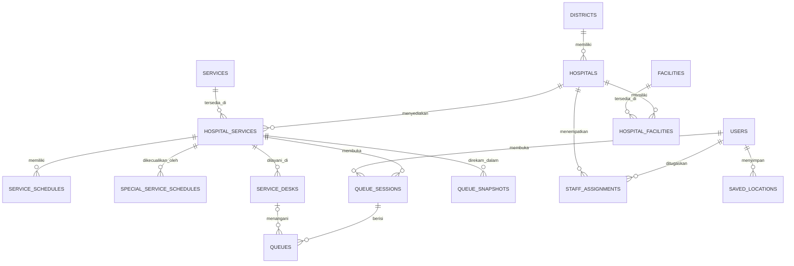

# Rujuk. — Laravel 12

Rujuk. adalah aplikasi direktori rumah sakit untuk proyek UTS Basis Data. Masyarakat dapat mencari dan membandingkan rumah sakit, sedangkan pengelola dapat mengelola datanya melalui CRUD.

## Fitur yang tersedia

- Pencarian publik berdasarkan nama, alamat, atau kota.
- Filter kelas dan kepemilikan rumah sakit.
- Pengurutan jarak terdekat memakai lokasi peramban dan rumus Haversine.
- Detail rumah sakit, fasilitas, kontak, dan tautan Google Maps.
- Pengambilan nomor antrean publik untuk layanan yang sedang membuka sesi.
- Tiket antrean digital dengan status, jumlah antrean di depan, estimasi waktu tunggu, nomor yang dipanggil, dan loket.
- Login dan logout admin maupun petugas, termasuk penolakan akun nonaktif.
- Tambah, lihat, ubah, dan hapus data rumah sakit.
- Panel data master UTS untuk CRUD kecamatan, layanan, relasi rumah sakit–layanan, jadwal rutin, jadwal khusus, loket, akun, dan penugasan petugas.
- Hak akses berbasis peran: admin mengelola data master, sedangkan petugas hanya mengoperasikan antrean rumah sakit aktif dalam penugasannya.
- Dashboard antrean untuk membuat loket, membuka sesi, memanggil antrean berikutnya, memulai dan menyelesaikan layanan, membatalkan antrean, serta menutup sesi.
- Snapshot statistik antrean otomatis pada setiap perubahan status operasional.
- Relasi many-to-many rumah sakit dengan fasilitas.
- Relasi kecamatan, layanan medis, jadwal, loket, petugas, sesi antrean, dan lokasi pengguna.
- Validasi Form Request, route model binding, CSRF, session regeneration, dan middleware autentikasi.
- Seeder enam rumah sakit demonstrasi, sembilan fasilitas, loket layanan, dan sesi Rawat Jalan harian.
- Feature test untuk fungsi publik, autentikasi, validasi, CRUD, dan alur antrean penuh.

## Teknologi

- Laravel 12
- PHP 8.2 atau lebih baru
- MySQL/MariaDB
- Blade, CSS, dan JavaScript native
- Tidak membutuhkan proses build frontend

## Struktur database

Penjelasan lengkap setiap relasi dan aturan integritas tersedia di [DATABASE.md](DATABASE.md).



`services` menyimpan layanan medis yang dapat memiliki jadwal dan antrean. `facilities` tetap dipisahkan untuk sarana penunjang seperti ICU, CT Scan, ambulans, dan ruang operasi.

## Instalasi dengan Laragon

Kloning repositori, lalu masuk ke direktori proyek:

```bash
git clone https://github.com/Rhefanza/RS-database-system.git
cd RS-database-system
```

Nyalakan Apache dan MySQL di Laragon, lalu jalankan:

```bash
copy .env.example .env
composer install
php artisan key:generate
```

Buat database kosong bernama `rujuk_uts` melalui phpMyAdmin. Setelah itu jalankan:

```bash
php artisan migrate:fresh --seed
php artisan serve
```

Buka `http://127.0.0.1:8000`.

## Akun demo

```text
Email: admin@rujuk.test
Password: password

Email petugas: petugas@rujuk.test
Password: password
```

## Data dummy

Perintah `php artisan db:seed` menghasilkan dataset synthetic yang saling terhubung dan aman dijalankan berulang:

- 6 rumah sakit, 6 kecamatan, 6 master layanan, dan 33 relasi rumah sakit–layanan.
- 30 jadwal rutin, 6 jadwal khusus hari libur, dan 39 loket pada database baru.
- 1 admin, 6 petugas, 5 akun masyarakat demo, 6 penugasan, dan 5 lokasi tersimpan.
- 6 sesi antrean harian, 48 transaksi antrean pada database baru, serta 6 snapshot kondisi antrean.
- Status transaksi mencakup `WAITING`, `CALLED`, `SERVING`, `COMPLETED`, dan `CANCELLED`.

Seeder tidak menghapus data yang sudah ada. Karena itu, jumlah pada database pengembangan dapat lebih besar daripada baseline tersebut.

## Menjalankan pengujian

```bash
php artisan test
```

Pengujian mencakup halaman publik, detail dan 404, filter, proteksi halaman admin, login, logout, password salah, CRUD rumah sakit, validasi, pengambilan tiket, penomoran berurutan, pemanggilan, pelayanan, penyelesaian, pembatalan, dan penutupan sesi antrean.

## Cakupan tahap UTS

Tahap UTS telah mencakup ERD dan relational database MySQL, autentikasi admin/petugas, seluruh CRUD entitas operasional, relasi dan constraint, serta operasional antrean dasar. Data rumah sakit tetap berupa data demonstrasi.

Dashboard analitik lanjutan, peta interaktif penuh, estimasi perjalanan, rekomendasi berbobot, ETL, dan Data Warehouse tidak termasuk tahap ini dan disiapkan untuk UAS.
