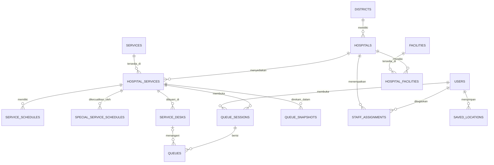

# Rujuk. — Laravel 12

Rujuk. adalah aplikasi direktori rumah sakit untuk proyek UTS Basis Data. Masyarakat dapat mencari dan membandingkan rumah sakit, sedangkan pengelola dapat mengelola datanya melalui CRUD.

## Fitur yang tersedia

- Pencarian publik berdasarkan nama, alamat, atau kota.
- Filter kelas dan kepemilikan rumah sakit.
- Pengurutan jarak terdekat memakai lokasi peramban dan rumus Haversine.
- Detail rumah sakit, fasilitas, kontak, dan tautan Google Maps.
- Login dan logout pengelola.
- Tambah, lihat, ubah, dan hapus data rumah sakit.
- Relasi many-to-many rumah sakit dengan fasilitas.
- Relasi kecamatan, layanan medis, jadwal, loket, petugas, sesi antrean, dan lokasi pengguna.
- Validasi Form Request, route model binding, CSRF, session regeneration, dan middleware autentikasi.
- Seeder enam rumah sakit demonstrasi dan sembilan fasilitas.
- Feature test untuk fungsi publik, autentikasi, validasi, dan CRUD.

## Teknologi

- Laravel 12
- PHP 8.2 atau lebih baru
- MySQL/MariaDB
- Blade, CSS, dan JavaScript native
- Tidak membutuhkan proses build frontend

## Struktur database

Penjelasan lengkap setiap relasi dan aturan integritas tersedia di [DATABASE.md](DATABASE.md).



`services` menyimpan layanan medis yang dapat memiliki jadwal dan antrean. `facilities` tetap dipisahkan untuk sarana penunjang seperti ICU, CT Scan, ambulans, dan ruang operasi.

## Instalasi dengan Laragon

Kloning repositori, lalu masuk ke direktori proyek:

```bash
git clone https://github.com/Rhefanza/RS-database-system.git
cd RS-database-system
```

Nyalakan Apache dan MySQL di Laragon, lalu jalankan:

```bash
copy .env.example .env
composer install
php artisan key:generate
```

Buat database kosong bernama `rujuk_uts` melalui phpMyAdmin. Setelah itu jalankan:

```bash
php artisan migrate:fresh --seed
php artisan serve
```

Buka `http://127.0.0.1:8000`.

## Akun demo

```text
Email: admin@rujuk.test
Password: password
```

## Menjalankan pengujian

```bash
php artisan test
```

Pengujian mencakup halaman publik, detail dan 404, filter, proteksi halaman admin, login, logout, password salah, create, update, sinkronisasi fasilitas, delete, cascade pivot, serta validasi.

## Batas tahap UTS

Data rumah sakit masih berupa data demonstrasi. Jarak yang ditampilkan adalah jarak garis lurus, bukan waktu tempuh jalan. Dashboard analitik, peta interaktif penuh, dan sistem rekomendasi berbobot disiapkan sebagai pengembangan UAS.
